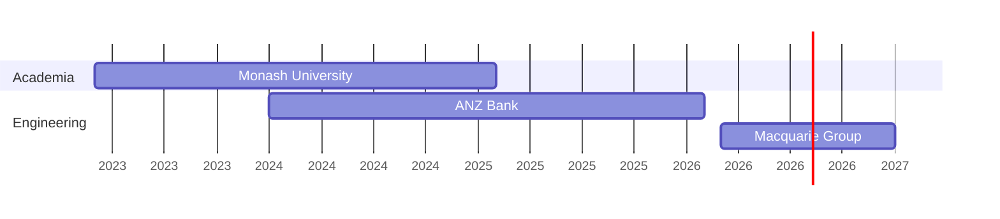

# Maximilian Craig

# About Me

👋 I'm Max, a Software Engineer based in Sydney. I've lived my entire life in Melbourne, however I have moved up to pursue a career in the Software Engineering industry. Welcome!

While you're stopping by, feel free to check out my [blog](/c/blog/readme/).

[Contact Me](/c/contactme/)

---

# Employment History

## Software Engineer — Macquarie Group

Sydney, Australia · Mar 2026 – Present

Working within the Software Development Lifecycle Team developing automated processes for provisioning GitHub Repositories and GitHub Advanced Security.

## Platform Engineer — ANZ Bank

Melbourne, Australia · Jan 2024 – Jan 2026

* Developed Kubernetes operators for automatic provisioning and lifecycle management of cloud infrastructure.
* Built and maintained CI/CD pipelines for deploying cloud-native applications.
* Investigated and implemented multi-region architectures to meet financial risk and resiliency requirements.
* Designed and executed automated migrations across 20,000+ configuration files.

## Teaching Associate — Monash University

Melbourne, Australia · Mar 2023 – Feb 2025

* Taught FIT1045: Introduction to Programming and FIT1008: Introduction to Computer Science.
* Led weekly workshops, supporting and teaching course material to 200+ students.
* Ran weekly consultations and oversaw the invigilation and marking of assessments.
* Achieved 95% student satisfaction.

---

# Projects

## [Giffy](https://github.com/maxcraig112/GoGiffy)

A multipurpose Discord bot designed to allow the manipulation, tagging, archiving and retrieval of gifs

## [Learning Vietnamese Numbers](https://vietnamese-numbers.maxcraig112.workers.dev/)

A website to help you practice saying and reading Vietnamese numbers from 1-1,000

## [Esoteric Puzzles](https://github.com/maxcraig112/Esoteric-Puzzles/blob/main/README.md)

> **Esoteric Puzzle**
> 
> A puzzle that is unique, unusual, or deliberately hard to understand, often requiring niche knowledge, unconventional thinking, or hidden rules to solve.

## [Anki Heisig Card Generator](https://github.com/maxcraig112/Anki-Heisig-Card-Generator)

A Program for automatically generating Anki flashcards relating to Kanji from `Remembering the Kanji` by James Heisig.

---

# Hobbies

## Hiking

I love to hike when I get the chance! Noteable hikes I've done include

### Koyasan Choishi-Michi Pilgrimage

A 24 km trail that connects the town of Kudoyama to Koyasan, the founding place of the largest branch of Buddhism, and home to Okunoin Cemetery, the largest in Japan.

### Summit of Cradle Mountain and Circuit of Dove Lake

A mountain located within the Central Highlands of Tasmania, including a 12km loop with a summit 1,545m above sea level.

### The Great North Walk

The Great North Walk is a 260km track that stretches from Sydney to Newcastle. I've completed parts of this trail and highly reccomend it!

## Self-Hosting

I currently run a Home Server where I self-host applications, games, and run tests.

* [Proxmox](https://www.proxmox.com/en/) is used to manage the deployment of VMs and Containers
* [Tailscale](https://tailscale.com/) is used to remotely access my VMs

I'm currently self-hosting

1. A [Jellyfin](https://github.com/jellyfin/jellyfin) home media server
2. A self hosted OneDrive using [OpenMediaVault](https://www.openmediavault.org/)
3. Minecraft servers via [MineOS](https://mineos.net/)
4. Network Wide Ad Blocking via [Pi-hole](https://pi-hole.net/)

### Specs

| Component | Details |
| --------- | ------- |
| CPU | AMD Ryzen 5 5600X 6-Core (12 Threads) |
| RAM | 32 GB DDR4 |
| GPU | NVIDIA GeForce GTX 1060 |
| Storage | 2x 4TB Seagate IronWolf HDD, 500GB Samsung 970 EVO M.2 NVMe |
| Hypervisor | Proxmox VE 8.3.0 |
| Kernel | Linux 6.8.12-4-pve |
