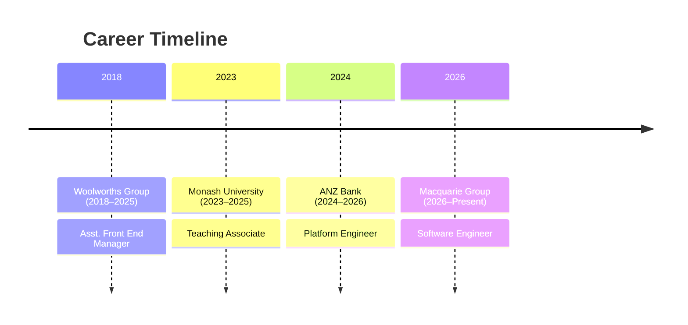

# Maximilian Craig

👋 I'm Max, a software engineer based in Sydney. Welcome!

If you've stopping by, feel free to check out my

* [Blog](blog/)
* [Projects](projects/)
* [Contact](contact.md)

---

# About Me

I'm a 23 year old Software Engineer based in Sydney (formally Melbourne). I graduated from Monash University with a double degree in Computer Science and Software Engineering (Honours)

---

# Employment History

## Software Engineer — Macquarie Group

Sydney, Australia · Mar 2026 – Present

Working within the Software Development Lifecycle Team developing automated processes for provisioning GitHub Repositories and GitHub Advanced Security.

## Platform Engineer — ANZ Bank

Melbourne, Australia · Jan 2024 – Jan 2026

* Developed Kubernetes operators for automatic provisioning and lifecycle management of cloud infrastructure.
* Built and maintained CI/CD pipelines for deploying cloud-native applications.
* Investigated and implemented multi-region architectures to meet financial risk and resiliency requirements.
* Designed and executed automated migrations across 20,000+ configuration files.

## Teaching Associate — Monash University

Melbourne, Australia · Mar 2023 – Feb 2025

* Taught FIT1045: Introduction to Programming and FIT1008: Introduction to Computer Science.
* Led weekly workshops, supporting and teaching course material to 200+ students.
* Ran weekly consultations and oversaw the invigilation and marking of assessments.
* Achieved 95% student satisfaction.

# Hobbies

## Hiking

I love to hike when I get the chance! Noteable hikes I've done include

### Koyasan Choishi-Michi Pilgrimage

A 24 km trail that connects the town of Kudoyama to Koyasan, the founding place of the largest branch of Buddhism, and home to Okunoin Cemetery, the largest in Japan.

### Summit of Cradle Mountain and Circuit of Dove Lake

A mountain located within the Central Highlands of Tasmania, including a 12km loop with a summit 1,545m above sea level.

# Projects

## [Giffy](https://github.com/maxcraig112/GoGiffy)

A multipurpose Discord bot designed to allow the manipulation, tagging, archiving and retrieval of gifs

## [Learning Vietnamese Numbers](https://vietnamese-numbers.maxcraig112.workers.dev/)

A website to help you practice saying and reading Vietnamese numbers from 1-1,000

