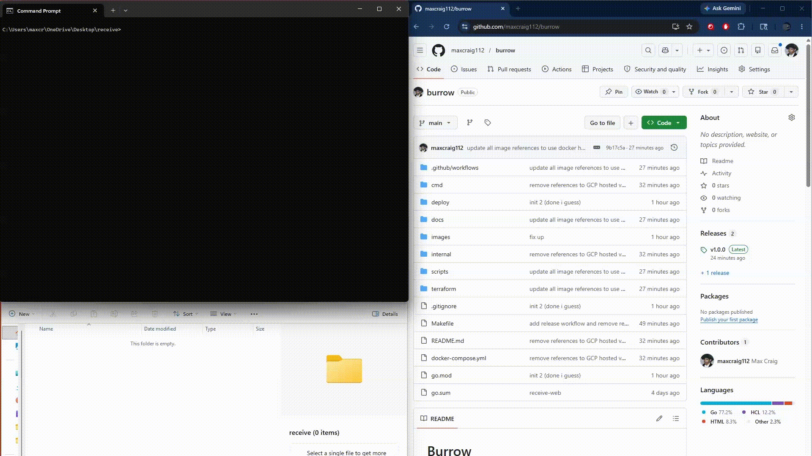

import logoSrc from './images/burrow/logo.png'
import gopherSrc from './images/burrow/golang-gopher.png'
import wormholeSrc from './images/burrow/magic-wormhole.png'
import fileTransferSrc from './images/burrow/file-transfer.png'
import repoReviewSrc from './images/burrow/repo-preview.png'
import googleDriveSrc from './images/burrow/google-drive.png'
import onedriveSrc from './images/burrow/onedrive.png'
import dropboxSrc from './images/burrow/dropbox.png'

<CSlide theme="dark">

# Burrow

Encrypted peer-to-peer file transfer, entirely under your control.

</CSlide>

---

<CGrid template="2 1" align="center">
<div>

## Problem statement

Sending files between devices means either

- **Syncing Everything**
    - Difficult or expensive
- **Using a middleman**
    - Uploading files to a cloud drive just to download them somewhere else
- **Tolerating Sync delay**
    - Files don't always arrive immediately

</div>
<div style="display: flex; flex-direction: column; gap: 2rem; align-items: center; justify-content: center;">


</div>
</CGrid>

---

<CGrid template="1 1" align="center">
<div>

## I want a tool that can

1. Transfer files between devices
2. Avoid third parties / middlemen
3. Be self hosted (free for life)

</div>
<div>


</div>
</CGrid>

---

<CGrid template="1 1" align="center top">
<div>

## Current solution: Magic Wormhole

```bash
% wormhole send important-stuff.txt

Wormhole code is: 7-guitarist-revenge
```

```bash
% wormhole receive 7-guitarist-revenge

Receive file written to important-stuff.txt
```

</div>
<div>


</div>
</CGrid>

---

## The Problem with Wormhole

<div class="fragment">

> [!WARNING] Third-party relay servers
> All file data travels through servers you don't own or control.

</div>

<div class="fragment">

> [!WARNING] Single file transfers only
> Repeated commands to transfer multiple files

</div>

<div class="fragment">

> [!WARNING] Not compatible with mobile
> Cannot download or run Python programs

</div>

---

<CGrid template="1 1" align="center">
<div>

## Burrow

- Encrypted P2P file transfer
- Entirely self-hosted
- Single and multi-file transfers
- Built for cross-platform & mobile

</div>
<div>


</div>
</CGrid>

---

<CGrid template="1 1" align="center top">
<div>

## Burrow is completely self-hosted

</div>
<div>

#### Docker Compose
```yaml filename="docker-compose.yml"
services:
  burrow-exchange:
    image: maximiliancraig112/burrow-exchange:latest
    restart: unless-stopped
    ports:
      - "8080:8080"

  burrow-relay:
    image: maximiliancraig112/burrow-relay:latest
    restart: unless-stopped
    ports:
      - "9090:9090"   # P2P relay
      - "8082:8082"   # web dashboard
    environment:
      TUNNEL_PUBLIC_URL: http://your-server:8082
```

</div>
</CGrid>

---
<CGrid template="1 1" align="center top">
<div>
<br></br>
<br></br>
<br></br>
<br></br>

## Feature parity with Magic Wormhole

</div>
<div>

### Send
Sender initiates the transfer
```bash
burrow send photo.jpg

# Connecting to exchange server...
Code: swift-copper-leaps
# Waiting for receiver
```

### Receive
Receiver accepts the file via the nameplate
```bash
burrow receive swift-copper-leaps

# Connecting to exchange server...
# Connecting to relay...

# Receiving photo.jpg (182.4 KB)
Saved to C:\Path\photo.jpg
Done!
```
</div>
</CGrid>

---


## Multi-file transfers & mobile support




---

<CGrid template="1 1" align="center">
<div>

## Written in Golang

- Static binaries
- Strong type + error checking
- Fast running

</div>
<div>


</div>
</CGrid>

---

<CGrid template="1 1" align="center">
<div>

## Give it a try!

[github.com/maxcraig112/burrow](https://github.com/maxcraig112/burrow)

</div>
<div>


</div>
</CGrid>

---

# Questions?
